# Agent Studio

> A production-oriented, multi-tenant platform for building, grounding, evaluating, publishing, and operating AI agents.

Agent Studio turns prompts, model providers, reusable knowledge bases, tools, schemas, and approval-controlled workflows into versioned AI agents. It supports synchronous task/chat agents and durable LangGraph workflow agents, while keeping tenant isolation, execution budgets, citations, evaluation gates, and observability inside the application boundary.

The project is implemented as a **Next.js frontend**, a **Python 3.12 FastAPI modular monolith**, and **Supabase PostgreSQL/Auth/Storage**. It includes a complete RAG lifecycle: durable ingestion, deterministic chunking, local embeddings, pgvector indexing, hybrid retrieval, grounded generation, verified citations, regression evaluation, and live operational events.

## Product status

The nine planned platform milestones are implemented:

1. Reusable tenant-owned knowledge bases.
2. Durable document ingestion and extraction.
3. Chunking, local embeddings, pgvector, and semantic search.
4. Versioned agent knowledge binding and grounded hybrid RAG.
5. Deterministic RAG evaluation and publication quality gates.
6. Direct SDK and LangChain LCEL runtime comparison.
7. Durable LangGraph research workflows with human approval.
8. Safe, opt-in conversational memory.
9. Replayable SSE events and production observability.

## Product tour

### Agent workspace

Create task, chat, or workflow agents; manage drafts; and open version-specific configuration.

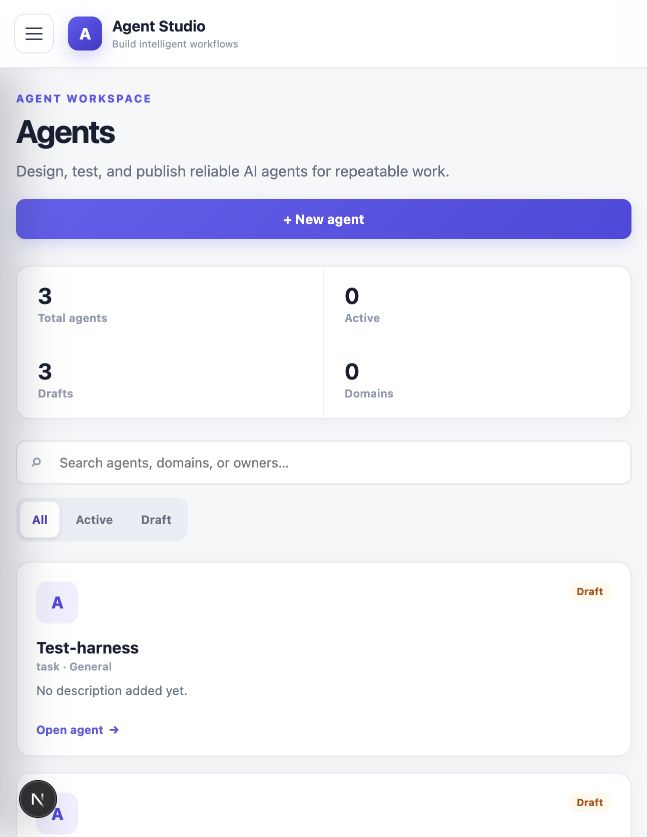

### Agent overview

Inspect version status, release readiness, evaluation state, and available actions from one workspace.

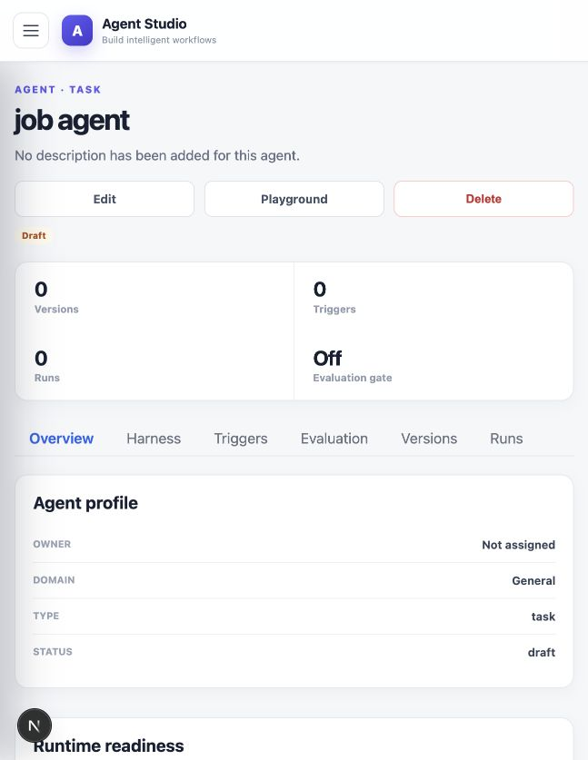

### Agent Builder

Choose a provider connection and model, Direct SDK or LangChain LCEL, free-key limits, prompts, schemas, tools, knowledge bases, MCP tools, connectors, triggers, and evaluation policy.

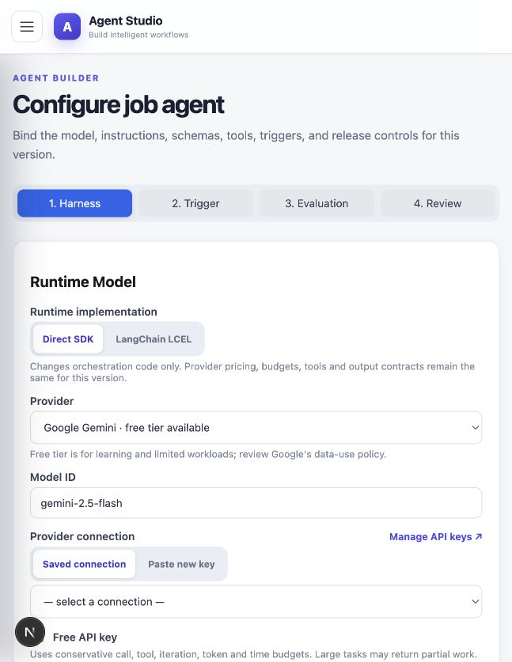

### Playground

Run the selected agent version, inspect retrieval/tool activity, grounding status, citations, runtime statistics, and structured output.

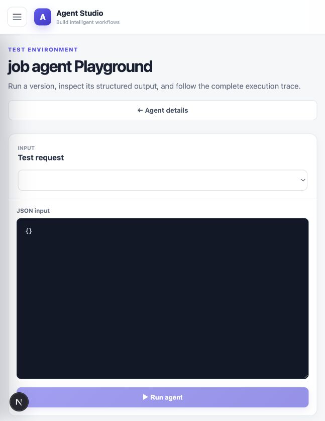

### Content Store and RAG indexing

Organize reusable knowledge bases, upload PDF/TXT/Markdown documents, monitor extraction and indexing independently, retry failures, and test semantic search.

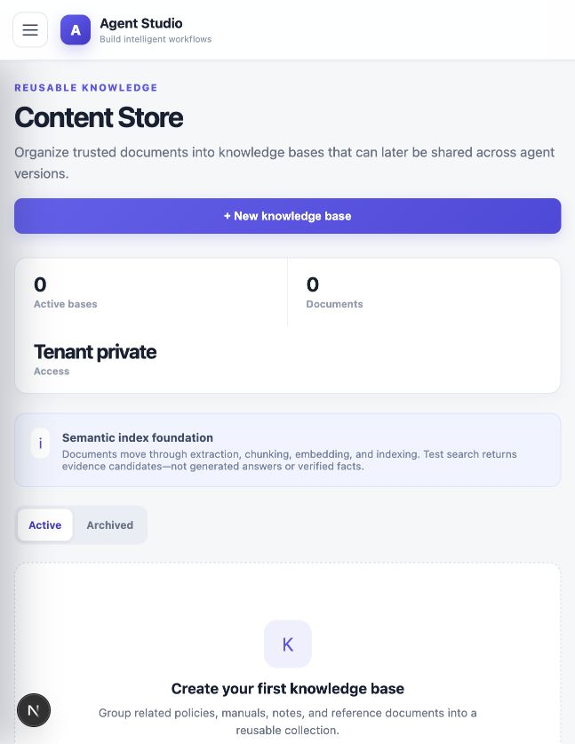

### Conversations

Create tenant-owned chat threads pinned to immutable agent versions. Memory is opt-in, bounded, summarized, expiring, and independently deletable.

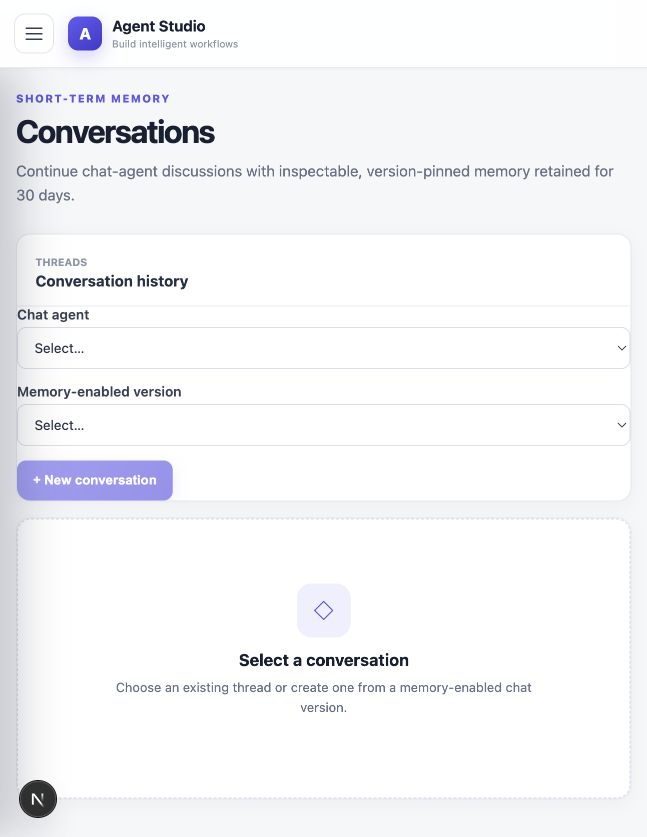

### Tools and integrations

The platform exposes code-owned tools, reusable skills, JSON schemas, MCP servers, and external connectors through allowlisted agent-version configuration.

| Platform tools | Skills | Schemas |
|---|---|---|
| 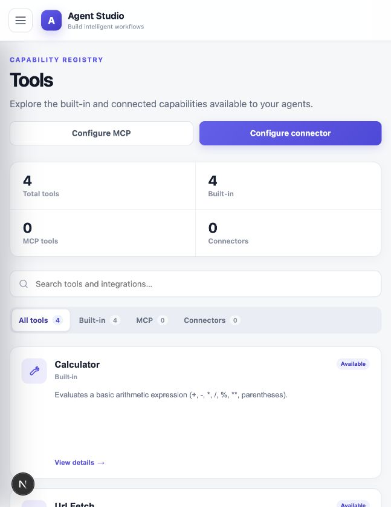 | 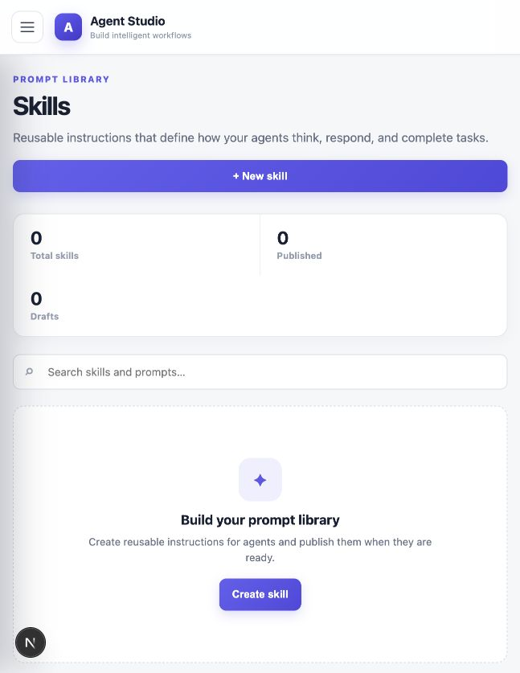 | 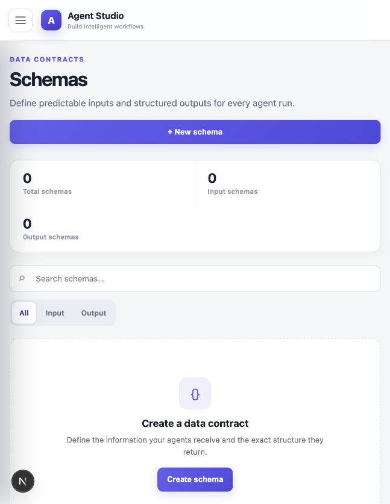 |

| MCP servers | Connectors |
|---|---|
| 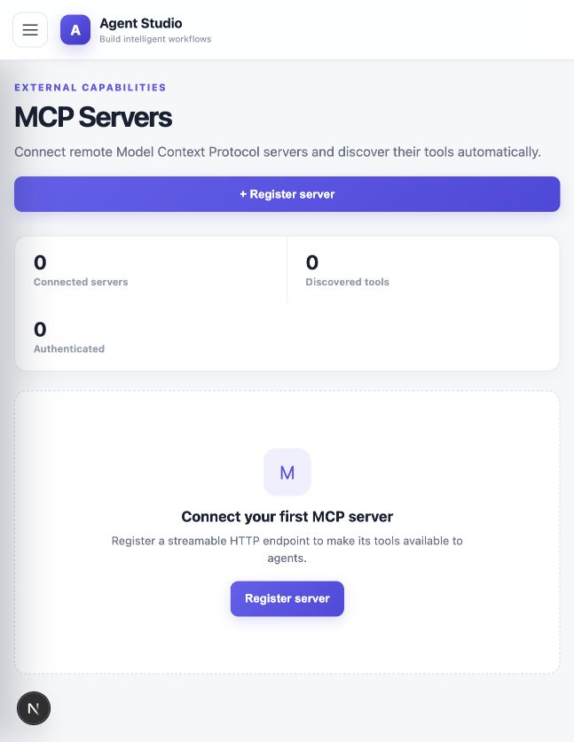 | 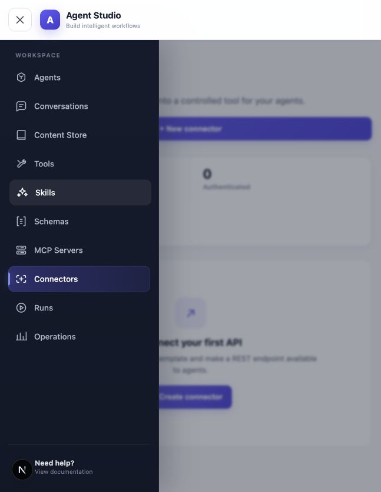 |

### Runs and operations

Run history preserves normalized lifecycle, output, usage, grounding, failure, and trace information. Operations streams durable tenant-safe events and reports queue and worker health.

| Runs | Operations |
|---|---|
| 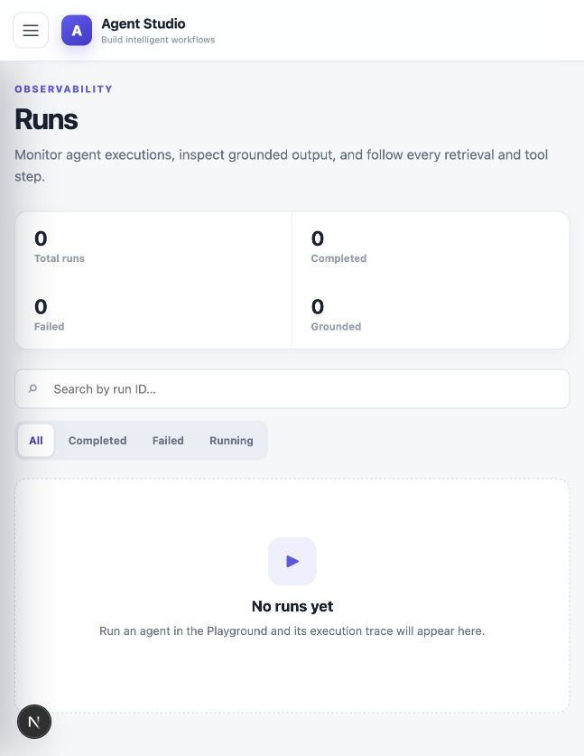 | 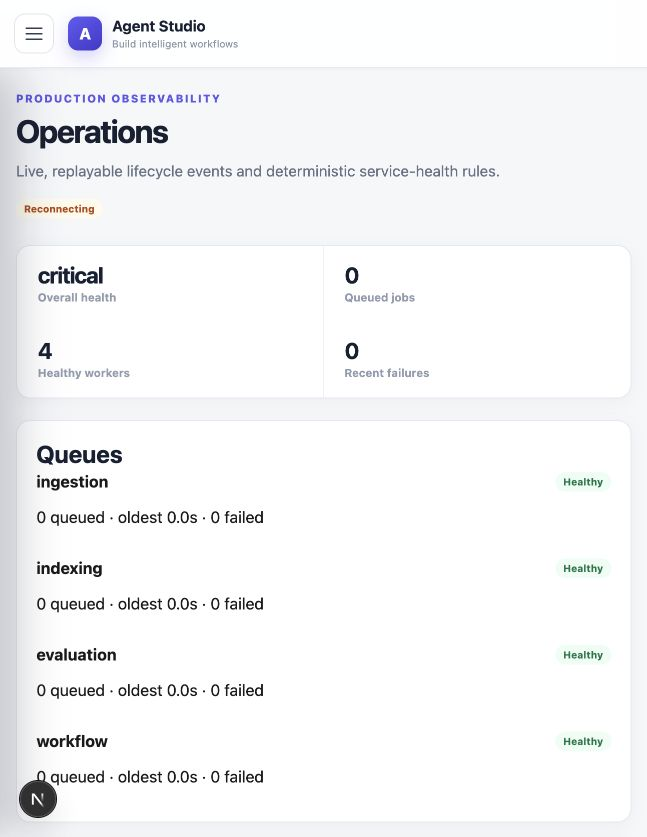 |

## Core capabilities

- **Agent lifecycle:** draft, configure, validate, evaluate, publish, run, and inspect immutable versions.
- **Provider choice:** OpenAI, Anthropic, Gemini, Groq, and OpenRouter through encrypted tenant connections.
- **Free-key mode:** conservative model/tool/token/time budgets with deterministic failure diagnosis and safe partial progress.
- **Structured execution:** JSON input/output schemas and a server-validated final-answer envelope.
- **Reusable knowledge:** one knowledge base can be bound to multiple immutable agent versions.
- **Grounded RAG:** automatic hybrid retrieval plus bounded follow-up retrieval through `search_documents`.
- **Trusted citations:** models return source IDs; the server resolves them against the run-owned evidence ledger.
- **Quality gates:** golden datasets measure retrieval, citation, grounding, and exact structured-output regressions.
- **Pluggable orchestration:** compare a framework-free Direct SDK runtime against LangChain LCEL.
- **Durable workflows:** LangGraph research graphs resume from encrypted PostgreSQL checkpoints.
- **Human approval:** MCP and connector actions pause before external effects and require an explicit decision.
- **Conversation memory:** recent turns plus bounded summaries for opt-in chat agents only.
- **Production operations:** PostgreSQL job leases, worker heartbeats, replayable SSE, sanitized events, and metrics.

## High-level architecture (HLD)

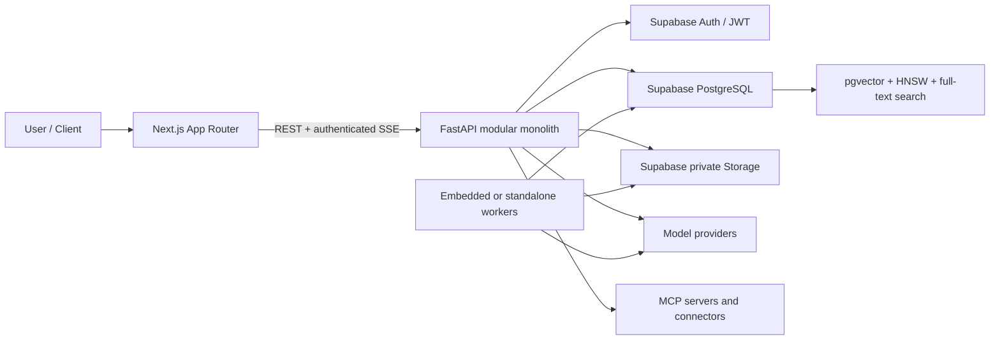

### Why a modular monolith

Agent Studio needs strict transactions across versions, bindings, runs, jobs, events, and evaluation results. A modular monolith keeps these operations reliable and deployable on a free/small cloud footprint while retaining clean module boundaries. Long-running work is already separated through durable PostgreSQL jobs, so workers can scale independently without prematurely introducing network-heavy microservices.

The design can later extract high-load modules—indexing, workflows, or evaluation—behind the same application-owned ports.

## Backend low-level design (LLD)

Each business module follows four layers:

```text
domain/          entities, value objects, invariants, state transitions
application/     use cases, policies, ports, transaction boundaries
infrastructure/  SQLAlchemy repositories and external adapters
presentation/    FastAPI routers, dependencies, and Pydantic DTOs
```

Applied patterns:

- **Repository:** tenant-scoped persistence without leaking SQL into domain logic.
- **Unit of Work:** one explicit transaction for each command.
- **Ports and adapters:** model, storage, retrieval, MCP, connector, and runtime implementations remain replaceable.
- **Strategy and Factory:** choose providers, parsers, tools, chunkers, and runtime engines.
- **Policy objects:** centralize authorization, publication, free-key budgets, and retry rules.
- **Dependency injection:** FastAPI composes services while keeping routes thin.
- **State machines:** document, index, evaluation, run, workflow, approval, and conversation lifecycles permit only valid transitions.

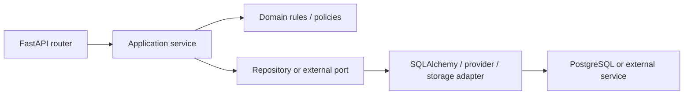

## RAG pipeline

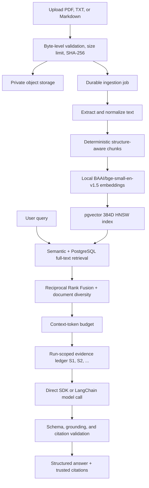

### Indexing decisions

- `BAAI/bge-small-en-v1.5` runs locally through FastEmbed, avoiding an embedding API key and keeping document text inside the deployment.
- Chunks target 384 embedding tokens, cap at 480, and retain 48 tokens of contextual overlap.
- Deterministic IDs and a versioned indexing configuration make reindexing reproducible.
- Index replacement is atomic: an older usable generation is not removed until the complete new generation succeeds.
- Semantic cosine candidates and exact/keyword candidates are fused with Reciprocal Rank Fusion.
- Retrieval enforces tenant, bound knowledge bases, indexed state, document diversity, result limits, and context budgets before any text reaches the model.

### Grounding and citations

Similarity is evidence relevance—not truth. Every retrieved chunk receives a server-issued source ID. The model may cite only those IDs; filenames, chunk IDs, pages, and scores come from trusted server metadata. Invented, deleted, cross-run, or malformed citations are rejected. When evidence is empty or inadequate, the expected result is `insufficient_evidence`, not an unsupported answer.

## Direct SDK, LangChain, and LangGraph

| Concern | Direct SDK | LangChain LCEL | LangGraph |
|---|---|---|---|
| Purpose | Minimal provider interaction | Composable prompts, messages, models, tools, retrievers | Durable multi-step workflow orchestration |
| Execution | Explicit bounded loop | Same loop through LCEL runtime adapter | State graph with nodes and conditional edges |
| Best fit | Task/chat agents, lowest abstraction | Task/chat agents, framework comparison | Long research workflows and approval pauses |
| Persistence | Run and trace records | Run and trace records | Encrypted PostgreSQL checkpoints + workflow jobs |
| Application-owned controls | Authorization, budgets, tools, citations, schemas | Same | Same, plus approval and resume policies |

### LangChain LCEL flow

`ChatPromptTemplate → bounded evidence/messages → bind_tools → chat model → normalized model turn`

LangChain is an optional adapter behind `RuntimeSessionPort`. It does not own authorization, tenant filtering, tool allowlists, evidence IDs, execution budgets, retry classification, or final schema validation. Keeping those controls outside the framework makes Direct and LangChain runs comparable and preserves a rollback path.

### LangGraph workflow pipeline

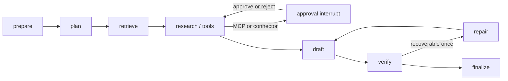

Workflow submission returns `202`. A leased worker resumes the graph using a stable thread ID and encrypted PostgreSQL checkpoints. Safe tools run automatically; MCP and connector calls always pause first. Rejected actions become safe tool results. Ambiguous external outcomes after a crash are never blindly repeated.

## Main use cases

1. **Internal knowledge assistant:** answer policy, handbook, or product questions with verified page-level sources.
2. **Customer-support copilot:** retrieve troubleshooting material and produce schema-valid case guidance.
3. **Research workflow:** plan research, retrieve internal evidence, call approved external tools, verify, and return a grounded report.
4. **Document intelligence:** ingest a reusable corpus and debug ranked semantic/keyword evidence before enabling generation.
5. **Structured automation:** turn natural-language requests into validated JSON for downstream systems.
6. **Agent experimentation:** compare Direct SDK and LangChain using the same providers, tools, prompts, budgets, and golden dataset.
7. **Regulated release process:** prevent publishing when retrieval, citation, grounding, or output-quality thresholds regress.
8. **Version-pinned chat:** preserve bounded conversation context without silently changing the underlying agent version.

Suitable agents include policy assistants, product/documentation assistants, support copilots, research agents, onboarding assistants, compliance evidence discovery, and structured task executors. The current English-first embedding model is less suitable for multilingual retrieval, image/video understanding, OCR-only documents, or highly specialized domains without evaluation and model adaptation.

## Functional requirements

- Tenant users can manage agents, immutable versions, prompts, provider connections, secrets, tools, skills, schemas, MCP servers, connectors, triggers, knowledge bases, datasets, and conversations.
- PDF, TXT, and Markdown uploads are validated, deduplicated, stored privately, extracted asynchronously, indexed, retried, or safely deleted.
- Draft agent versions bind up to five active knowledge bases and published bindings are immutable.
- Runs enforce version configuration, input/output schemas, tool allowlists, provider budgets, retrieval limits, and citation validation.
- Evaluation runs are durable, resumable, reproducible, and capable of blocking publication.
- Workflow agents support queueing, checkpoint resume, cancellation, node events, and human approval.
- Chat agents optionally support pinned conversation memory, summarization, expiry, clear, archive, and delete.
- Clients can replay lifecycle activity with SSE `Last-Event-ID` semantics and fall back to bounded polling.

## Non-functional requirements

| Quality | Implementation |
|---|---|
| Security | Supabase JWT validation, tenant-scoped queries, RLS, encrypted provider keys/checkpoints, redacted logs/events |
| Reliability | Durable PostgreSQL jobs, leases, bounded retries, idempotent transitions, atomic index replacement |
| Availability | Multiple API/worker replicas can claim work safely; DB maintenance leaves jobs queued for recovery |
| Scalability | Separately configurable workers, `FOR UPDATE SKIP LOCKED`, batch embeddings, HNSW, bounded SSE reads |
| Performance | Local batched embeddings, hybrid indexed search, context limits, conservative worker concurrency |
| Maintainability | Modular monolith, ports/adapters, typed DTOs, append-only Alembic migrations, code-owned tool catalog |
| Observability | Correlation IDs, structured logs, Prometheus metrics, durable events, traces, worker heartbeats |
| Privacy | Private object storage, no prompt/document text in operational logs, explicit memory deletion and retention |
| Compatibility | Stable paths, snake_case DTOs, legacy harness defaults, additive migrations, unchanged `run.output` |

## Reliability under failure

- **Database maintenance:** jobs remain durable and are claimed after the database returns.
- **Worker crash:** an expired lease makes unfinished work reclaimable; completed transitions are idempotent.
- **Storage outage:** transient failures retry without losing job state; deterministic document failures do not loop.
- **Embedding/index failure:** extracted text remains available and the previous index generation is preserved.
- **Provider throttling:** failures are classified and surfaced with retryability, consumed budget, and safe recommendations.
- **Browser disconnect:** durable jobs continue; SSE reconnect replays missed events exactly once in the client view.
- **External action crash:** ambiguous MCP/connector effects fail safely instead of being automatically repeated.
- **Vector search unavailable:** knowledge-required runs report `retrieval_unavailable` or insufficient evidence rather than fabricating sources.

## Technology stack

### Frontend

- Next.js App Router, React, and TypeScript
- Supabase browser authentication
- Authenticated fetch-based SSE with replay and fallback polling
- Responsive custom design system

### Backend and AI

- Python 3.12 and FastAPI
- Pydantic, SQLAlchemy, Alembic, HTTPX
- Direct OpenAI/Anthropic/Gemini-compatible provider adapters
- LangChain LCEL and LangGraph PostgreSQL checkpointing
- FastEmbed with `BAAI/bge-small-en-v1.5`
- PDF extraction through pypdf

### Data and infrastructure

- Supabase PostgreSQL, Auth, and private Storage
- pgvector `vector(384)`, HNSW cosine index, and PostgreSQL full-text/GIN search
- PostgreSQL-backed ingestion, indexing, evaluation, workflow, and activity queues
- Docker and Docker Compose
- Prometheus-compatible metrics

## Repository structure

```text
Agent_Studio/
├── api/
│   ├── app/
│   │   ├── modules/          # knowledge, content, semantic index, retrieval
│   │   ├── runtime/          # Direct and LangChain runtime adapters
│   │   ├── workflows/        # LangGraph graph, worker, checkpoints, approvals
│   │   ├── evaluation/       # deterministic RAG quality metrics and worker
│   │   ├── conversations/    # pinned chat memory and summarization
│   │   └── observability/    # events, SSE, metrics, worker health
│   ├── migrations/versions/  # append-only Alembic history
│   └── tests/
├── web/                      # Next.js application
├── architecture/python-fastapi/
│   ├── HLD.md
│   └── LLD.md
├── docs/screenshots/
├── LEARNING-ROADMAP.md
└── docker-compose.yml
```

## Local setup

### Prerequisites

- Python 3.12–3.14
- Node.js 20+
- A Supabase project with PostgreSQL, Auth, Storage, and pgvector access
- Docker Desktop is optional but recommended

### Environment

```bash
cp api/.env.example api/.env
cp web/.env.example web/.env.local
```

Populate the copied files with the Supabase database URL, project URL, authentication settings, storage configuration, encryption keys, and frontend public Supabase values. Never commit real provider keys or encryption keys.

### Start with Docker

```bash
docker compose up --build
```

- Web application: `http://localhost:3000`
- FastAPI: `http://localhost:8000`
- Health: `http://localhost:8000/health`
- Readiness: `http://localhost:8000/ready`

### Start manually

```bash
cd api
python3.12 -m venv .venv
source .venv/bin/activate
pip install -e '.[test]'
alembic upgrade head
python -m app.workflows.setup_checkpoints
uvicorn app.main:app --reload --port 8000
```

In a second terminal:

```bash
cd web
npm ci
npm run dev
```

For an existing database that predates Alembic, register the existing schema once with `alembic stamp 0001_existing_schema` before applying later revisions. Do not replay the baseline over populated tables.

### Worker deployment

Local/free deployments may use embedded workers. For production separation, disable embedded workers in the API configuration and run:

```bash
cd api
python -m app.worker
```

The database contract remains the same, so APIs and workers can scale independently.

## Verification

```bash
cd api
python -m pytest
python scripts/export_openapi.py

cd ../web
npm run build
```

The test suite covers domain rules, migrations, tenant isolation, document ingestion, deterministic chunking, pgvector retrieval, grounding/citations, evaluation metrics, runtime parity, LangGraph recovery/approval, conversation memory, SSE replay, redaction, and browser-facing states.

## Security invariants

- Every tenant-owned operation includes the authenticated Supabase user ID at service, repository, foreign-key, and RLS boundaries.
- Production validates JWT signature, issuer, audience, expiry, and subject.
- Local authentication bypass is rejected in production.
- API keys remain Fernet-encrypted and never appear in DTOs, logs, traces, events, or error details.
- Workflow checkpoints use a dedicated encryption key and strict serialization.
- Retrieved documents, conversation history, summaries, and tool output are treated as untrusted context—not system instructions.
- MCP and connector actions require human approval for workflow agents.
- Operational events exclude prompts, messages, document/chunk text, embeddings, credentials, signed URLs, and hidden reasoning.
- Database changes are append-only Alembic migrations; application startup performs no sample seeding.

## Current boundaries

The completed platform deliberately does not claim:

- OCR for scanned/image-only PDFs;
- image, audio, or video understanding;
- multilingual embedding quality beyond the selected English-first model;
- semantic factuality grading by an LLM judge;
- token-by-token response streaming;
- exactly-once external side effects;
- automatic provider/key switching;
- snapshotting all knowledge content into every published version.

These boundaries keep the current system deterministic, affordable, and explainable.

## Future scope

1. OCR and multimodal ingestion for images, scanned PDFs, audio, and video.
2. Multilingual and domain-specific embedding models with measured reindex migrations.
3. Query rewriting and reranking, introduced only when golden-dataset results justify the added latency/cost.
4. Token streaming and resumable response delivery alongside existing lifecycle SSE.
5. Advanced conversation/profile memory with explicit consent and independent retention controls.
6. Time-travel workflow branching, editable approvals, and richer operator controls.
7. External OpenTelemetry, alert routing, SLO dashboards, and audit exports.
8. Dedicated worker services or queues when workload data justifies extracting modules.
9. Enterprise SSO, team roles, workspace sharing, quotas, billing, and regional data policies.
10. Managed deployment templates for Supabase plus common cloud container platforms.

## Further documentation

- [High-Level Design](architecture/python-fastapi/HLD.md)
- [Low-Level Design](architecture/python-fastapi/LLD.md)
- [Learning Roadmap](LEARNING-ROADMAP.md)
- [FastAPI OpenAPI contract](api/contracts/fastapi-openapi.json)

---

Agent Studio is designed to demonstrate that production AI engineering is more than calling a model: it is data ownership, retrieval quality, deterministic controls, safe tool execution, durable workflows, measurable regressions, privacy, and operability working together.
