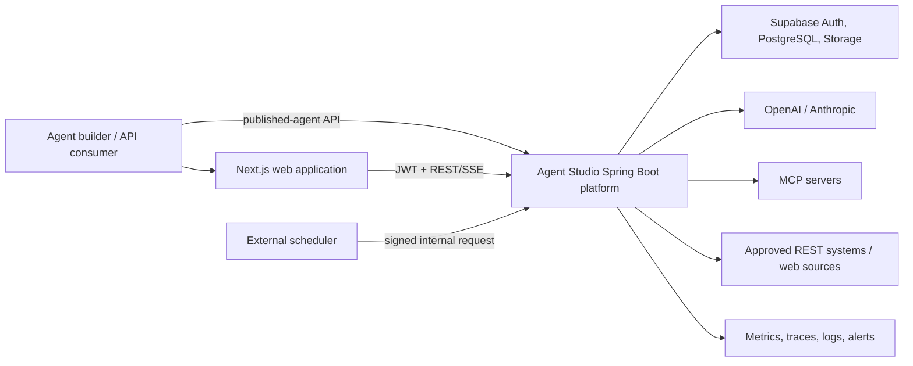
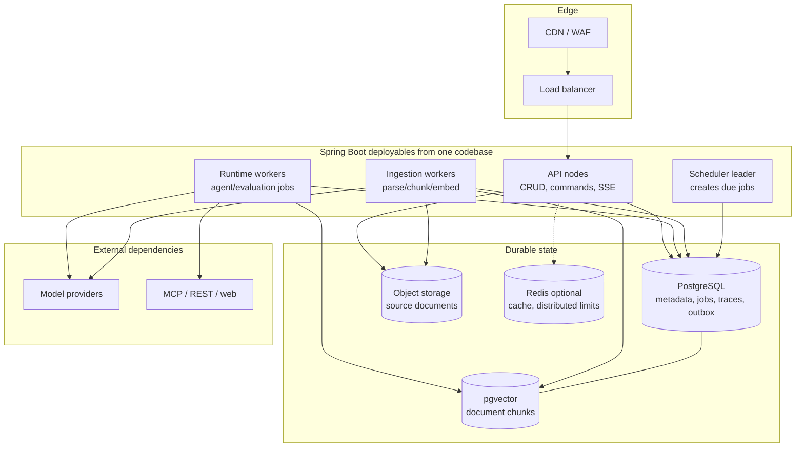
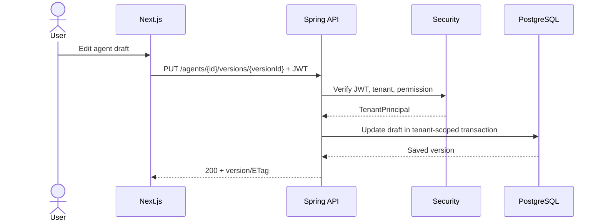
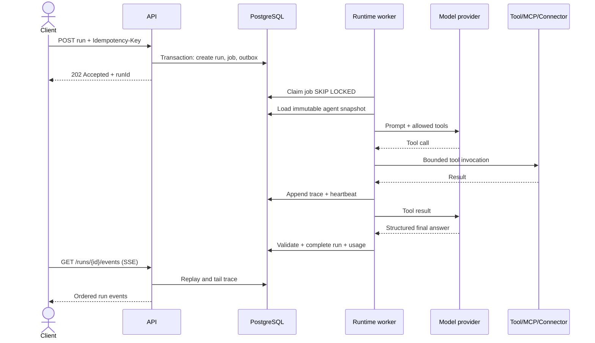
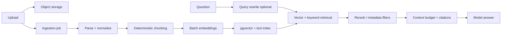
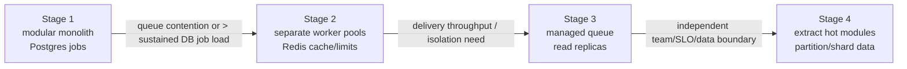

# High-Level Design — Agent Studio on Java 17 and Spring Boot

## 1. Goals

Agent Studio is a multi-tenant platform where users create, test, evaluate, publish, and run
tool-calling AI agents with private documents and user-owned model credentials.

The Java architecture must:

- preserve the current frontend API contract during migration;
- isolate every tenant and never expose stored credentials;
- run short requests interactively and long work asynchronously;
- provide immutable published agent versions and reproducible runs;
- support OpenAI, Anthropic, tools, MCP, REST connectors, RAG, and later workflows;
- remain observable, recoverable, horizontally scalable, and cost-controlled;
- avoid microservices until independently scaling or isolating a module is justified.

## 2. Architectural principles

1. **Control plane and runtime plane are logically separate.** Authoring cannot mutate a frozen
   version while it is executing.
2. **Published snapshots are self-contained.** A run references an immutable version containing
   the resolved prompt version, schema versions, allowlists, and model configuration.
3. **Long operations are jobs.** Agent runs, ingestion, embedding, evaluation, and scheduled work
   do not hold an HTTP request open.
4. **The database is the initial coordination backbone.** PostgreSQL transactions, an outbox, and
   claimable job rows provide durability before Kafka is warranted.
5. **External calls are untrusted and bounded.** Every provider/tool call has a timeout, budget,
   retry classification, circuit breaker, and audit record.
6. **Application code depends on ports, not vendors.** Spring AI, Supabase, MCP, and model SDKs are
   adapters replaceable without changing domain logic.
7. **At-least-once work must be idempotent.** Jobs and events can be retried safely.
8. **Measure before splitting.** Extract a module only for demonstrated scale, ownership, or
   reliability reasons.

## 3. System context

## 4. Logical architecture

The API, runtime worker, ingestion worker, and scheduler are separate process profiles built from
the same modules. They can be scaled and released independently without turning every domain into
a network service.

## 5. Domain modules

| Module | Responsibility | Owns |
|---|---|---|
| Identity | authenticated principal and tenant context | no business tables |
| Agents | agent drafts, immutable versions, publish policy | `agent`, `agent_version` |
| Skills | versioned prompts/instructions | `skill`, `skill_version` |
| Schemas | versioned JSON Schemas | `schema_entry`, `schema_version` |
| Tools | built-in tool catalog and execution contracts | `platform_tool` |
| MCP | server registration, discovery, invocation | `mcp_server`, `mcp_tool` |
| Connectors | safe external REST definitions | `connector` |
| Content | upload metadata and ingestion lifecycle | `content_item` |
| Retrieval | chunks, embeddings, keyword/vector retrieval | `document_chunk` |
| Runs | job orchestration, agent loop, traces, budgets | `run`, `run_step`, `job` |
| Evaluation | datasets, cases, scored experiments | evaluation tables |
| Triggers | API/manual/scheduled trigger definitions | `agent_trigger` |
| Secrets | encrypted BYOK references and resolution | `user_secret` |
| Usage | tokens, cost, latency, quotas | `usage_record` |
| Audit | security-sensitive immutable actions | `audit_event` |

Direct table access across module boundaries is forbidden. Modules communicate using public Java
interfaces for synchronous queries and domain events for side effects.

## 6. Request and job flows

### 6.1 Control-plane request

### 6.2 Asynchronous agent run

### 6.3 RAG ingestion and query

## 7. Deployment topology

### 7.1 Initial production

- Two API instances across separate failure domains where the platform permits it.
- Two runtime worker instances; each claims jobs from PostgreSQL.
- One or more ingestion workers with lower priority and separate concurrency limits.
- One logical scheduler with a PostgreSQL advisory lock; another instance may safely stand by.
- Managed PostgreSQL with point-in-time recovery, automated backups, connection pooling, and
  pgvector.
- Object storage for originals; CDN/WAF in front of Next.js and public APIs.
- No sticky sessions. Every API instance is stateless.

### 7.2 Growth path

Possible extractions, in likely order: ingestion, runtime execution, evaluation, then retrieval.
Agents/skills/schemas should remain together longer because they form one consistency boundary.

## 8. Scaling design

### API traffic

- Horizontal stateless API nodes behind a load balancer.
- Cursor pagination and bounded response sizes.
- ETags/optimistic locking for editor updates.
- HikariCP pool sized below database connection limits across all replicas.
- Redis-backed distributed rate limiting only after single-node/local limits are insufficient.

### Agent-run traffic

- `202 Accepted`; never keep ordinary run requests open.
- Separate worker pools and concurrency limits by workload class and provider.
- Per-tenant and global token/tool budgets prevent a noisy tenant from consuming all capacity.
- Autoscale using runnable-job depth, oldest-job age, active calls, and provider rate-limit headroom.
- Graceful shutdown stops claims, finishes or checkpoints current work, then releases leases.

### Ingestion traffic

- Upload directly to object storage through signed URLs for large files.
- Batch embedding calls and cap document/page/chunk counts.
- Hash source content and chunk configuration to make ingestion idempotent.
- Separate ingestion workers prevent large uploads from starving interactive runs.

### Database traffic

- Index tenant and lookup prefixes: `(user_id, id)`, run status/time, job state/available time.
- Partition high-volume `run_step`, `usage_record`, and `audit_event` tables by time when required.
- Use read replicas only for stale-tolerant history/analytics—not publish or run coordination.
- HNSW is the default pgvector candidate for query performance; choose IVFFlat only after testing
  its build/memory/recall tradeoffs on our dataset.

## 9. Availability and reliability

### Failure policy by dependency

| Dependency | Failure response |
|---|---|
| PostgreSQL | fail closed for writes; readiness fails; no fake success |
| Model provider | bounded retry for transient errors, circuit break, alternate model only if policy allows |
| MCP/tool | record failed step; let agent recover or fail according to tool criticality |
| Connector | retry only idempotent calls or calls with an idempotency key |
| Object storage | retry transient operations; keep ingestion job pending |
| Embedding provider | batch retry with checkpoint; do not publish a partial index as ready |
| Redis | bypass cache; rate limiting fails according to configured safety mode |

### Reliability mechanisms

- Job leases, heartbeats, retry counts, exponential backoff with jitter, and dead-letter state.
- Transactional outbox so domain changes and event publication cannot diverge.
- Idempotency keys on run creation and all externally repeatable commands.
- Append-only traces with database-assigned sequence numbers.
- Checkpoints after expensive or externally visible steps.
- Per-provider circuit breaker and bulkhead; separate pools prevent cascading saturation.
- Deployment readiness checks exclude warming/failed instances from traffic.
- Backward-compatible database migrations using expand/migrate/contract.

## 10. Traffic and failure scenarios

| Scenario | Expected behavior |
|---|---|
| Normal editor traffic | API serves CRUD synchronously; optimistic locking prevents lost edits |
| 100 users run agents together | requests return 202; fair job claims and tenant quotas drain backlog |
| One tenant submits thousands of runs | per-tenant queue/concurrency limits protect other tenants |
| Model returns 429 | respect retry-after, backoff, circuit break; job remains recoverable |
| Model response violates schema | one bounded repair attempt; then deterministic failure with trace |
| Tool hangs | tool timeout fires; bulkhead prevents worker exhaustion |
| Tool performs a write then response is lost | idempotency key prevents duplicate external action |
| Worker crashes mid-run | lease expires; another worker resumes from last safe checkpoint |
| API instance dies | load balancer routes to another instance; job continues independently |
| Scheduler runs twice | advisory lock and unique schedule occurrence key create only one job |
| Database failover | in-flight transactions roll back; clients retry idempotent requests |
| Huge PDF upload | signed upload + async ingestion; hard size/page limits; isolated worker pool |
| Malicious document prompt injection | retrieved text is marked untrusted; tool permissions remain server-enforced |
| MCP server targets private IP | SSRF policy blocks resolution and every redirect hop |
| Secret appears in a provider/tool error | centralized redaction prevents trace/log persistence |
| Hot deployment during traffic | rolling update, readiness gates, graceful worker drain |
| Regional outage | restore in secondary region according to declared RTO/RPO; avoid claiming active-active without cross-region data design |

## 11. Security

- Spring Security verifies Supabase JWT signature, issuer, audience, expiry, and subject.
- `TenantPrincipal` is derived only from the verified token; client-supplied tenant IDs are ignored.
- Repository methods require tenant scope; cross-tenant tests are mandatory.
- Secrets are encrypted with an envelope-key approach; traces contain references, never values.
- Tool allowlists are enforced in the runtime dispatcher, not merely in prompts or UI.
- Egress allow/deny policy blocks loopback, private, link-local, metadata, and rebinding attacks.
- File type is detected from content, scanned where available, size-limited, and parsed in an
  isolated process/container for higher-risk formats.
- Admin/internal endpoints use separate authentication, authorization, network policy, and audit.
- Prompt injection is treated as data-plane input, not as authority to expand permissions.

## 12. Observability

Every request/job has `traceId`, `tenantId` (hashed in metrics), `runId`, `agentVersionId`, and
`jobId` where relevant.

Measure:

- API request rate, error rate, and p50/p95/p99 latency;
- job queue depth, oldest age, claim latency, retries, dead letters;
- model/tool latency, error class, rate limits, token usage, and estimated cost;
- ingestion throughput, failed documents, chunks, embedding batches;
- database pool utilization, slow queries, locks, replication lag, and storage growth;
- evaluation quality and RAG retrieval metrics by version.

Prompts, documents, tool payloads, and model responses are not logged by default. Debug capture is
explicit, access-controlled, redacted, encrypted, sampled, and retention-limited.

## 13. Initial service objectives

These are design targets to validate under load, not claims about the current system.

| Capability | Target |
|---|---|
| Control-plane API availability | 99.9% monthly |
| Control-plane p95 latency | < 300 ms excluding uploads/external calls |
| Run acceptance p95 | < 500 ms |
| Accepted-run durability | no acknowledged run lost after committed response |
| Trace ordering | strictly increasing and replayable per run |
| Tenant isolation | zero cross-tenant reads/writes |
| Recovery point objective | <= 15 minutes initially |
| Recovery time objective | <= 4 hours initially |

## 14. Explicit non-goals for the first Java release

- Do not split into many microservices.
- Do not introduce Kafka merely for architectural appearance.
- Do not implement active-active multi-region writes.
- Do not promise exactly-once distributed side effects.
- Do not add LangGraph to Java; model orchestration is represented by application-owned runtime
  state machines. A Python specialized service can be added later behind a port if needed.
