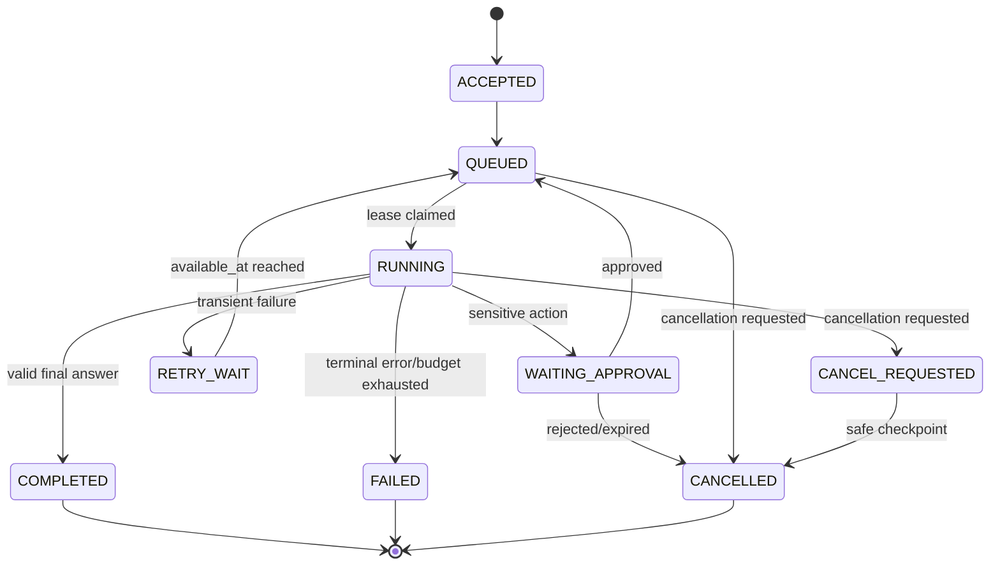
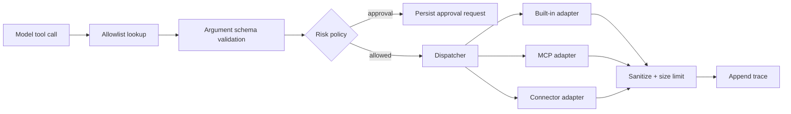

# Low-Level Design — Java 17 Spring Boot Backend

## 1. Repository and build layout

The initial dependency baseline is Spring Boot 3.5.16 with Spring AI 1.1.8. Versions are managed
centrally through Maven BOMs and changed only through tested dependency-upgrade pull requests.

```text
backend-java/
├── pom.xml
├── app/                         # bootable application and profile wiring
├── common/                      # ids, errors, clocks, tenant context, shared primitives
├── identity/                    # JWT/security adapter
├── agents/                      # aggregate, versions, publish policy
├── skills/
├── schemas/
├── secrets/
├── tools/
├── mcp/
├── connectors/
├── content/
├── retrieval/
├── runs/
├── evaluation/
├── triggers/
├── usage/
└── test-support/                # containers, fixtures, fake providers
```

Each domain module is a Maven module and a Spring Modulith application module. The `app` module is
the only executable assembly. API and worker artifacts use the same jar with profiles:

- `api`: controllers, SSE relay, command submission; job execution disabled;
- `runtime-worker`: agent and evaluation handlers;
- `ingestion-worker`: parsing, chunking, embedding handlers;
- `scheduler`: due-trigger scanner; HTTP disabled except management endpoints;
- `all-in-one`: local development only.

## 2. Internal architecture pattern

Every module uses ports and adapters:

```text
com.agentstudio.runs
├── api/                 # controllers and external DTOs
├── application/         # commands, queries, orchestration, transaction boundary
├── domain/              # aggregates, policies, value objects, domain events
├── port/in/             # module's public use cases
├── port/out/            # provider, repository, clock, dispatcher contracts
└── adapter/
    ├── persistence/     # JPA entities/repositories/mappers
    ├── ai/              # Spring AI/model adapters
    ├── tool/            # platform/MCP/connector dispatch
    └── events/          # outbox and module event adapters
```

Rules:

- controllers never call JPA repositories directly;
- domain packages contain no Spring, JPA, vendor SDK, or HTTP types;
- JPA entities are persistence models, not API DTOs;
- modules cannot import another module's internal packages;
- money/cost, model names, statuses, IDs, and budgets use validated value objects;
- all timestamps use injected `Clock` and UTC `Instant`.

## 3. Core interfaces

```java
public interface ChatModelPort {
    ModelTurn complete(ModelRequest request);
}

public interface EmbeddingPort {
    List<EmbeddingVector> embed(List<String> texts, EmbeddingOptions options);
}

public interface ToolDispatcherPort {
    ToolResult execute(AllowedTool tool, JsonNode arguments, ExecutionContext context);
}

public interface ObjectStoragePort {
    StoredObject put(UploadRequest request);
    InputStream get(StorageKey key);
    void delete(StorageKey key);
}

public interface RetrievalPort {
    List<RetrievedChunk> search(RetrievalQuery query);
}

public interface SecretResolverPort {
    SecretValue resolve(TenantId tenantId, SecretRef reference);
}
```

Spring AI is an adapter behind `ChatModelPort`, `EmbeddingPort`, and `RetrievalPort`. This prevents
framework types from becoming the domain contract and lets tests use deterministic fakes.

## 4. API conventions

- Base path: `/api/v1`; preserve old paths through compatibility routes during migration.
- JSON uses `snake_case` initially to avoid breaking the existing frontend.
- Errors use RFC 9457 Problem Details with stable application error codes.
- Commands that enqueue work return `202` with `Location: /runs/{id}`.
- Creation accepts `Idempotency-Key`; duplicate key plus same request returns original result.
- Mutable resources use an integer revision exposed as `ETag`; updates require `If-Match`.
- Pagination uses opaque cursors, not unbounded lists or page offsets for high-volume data.
- Every endpoint documents tenant scope, permission, limits, and idempotency.

## 5. Data model changes

The existing schema is migrated, not discarded. Key corrections:

### Immutable version snapshots

`agent_version` stores or references immutable versions of:

- system prompt and user prompt template;
- input/output JSON Schemas;
- tool/MCP/connector definitions relevant to execution;
- model/provider settings excluding secret values;
- RAG/retrieval policy;
- execution budgets.

A published version never points to mutable draft rows.

### Durable jobs

```sql
job(
  id uuid primary key,
  tenant_id uuid not null,
  type varchar not null,
  aggregate_id uuid not null,
  state varchar not null,
  priority int not null,
  available_at timestamptz not null,
  lease_owner varchar,
  lease_until timestamptz,
  heartbeat_at timestamptz,
  attempt int not null,
  max_attempts int not null,
  idempotency_key varchar,
  payload jsonb not null,
  last_error_code varchar,
  created_at timestamptz not null,
  completed_at timestamptz
)
```

Claim query uses `SELECT ... FOR UPDATE SKIP LOCKED`, sets a lease, and commits before executing
external work. A unique constraint covers the command's idempotency scope.

### Trace and usage

- `run_step(run_id, seq_no)` is unique and append-only.
- `usage_record` holds provider/model, input/output/cache tokens, latency, price-card version, and
  estimated cost.
- Raw provider request/response storage is disabled by default.

### Retrieval

`document_chunk` includes tenant, agent/content IDs, stable chunk ID, content hash, text,
metadata JSON, token count, embedding model/version, vector, and ingestion generation. Only a
fully completed generation becomes searchable.

## 6. Agent run state machine



Terminal states are immutable. Retrying a failed run creates an explicit new attempt/run link so
history is never rewritten.

## 7. Runtime algorithm

1. Claim a run job and acquire its lease.
2. Load the immutable version snapshot and tenant budgets.
3. Resolve the referenced model key into a short-lived in-memory value.
4. Construct system/user messages and the allowed tool catalog.
5. Check context-token and monetary budgets before the provider call.
6. Call the provider through resilience policies.
7. Append a sanitized model-call trace and usage record.
8. For tool calls: validate name against the server-side allowlist and arguments against schema.
9. Require approval when tool risk policy says so; otherwise dispatch with an idempotency key.
10. Append results, checkpoint, and repeat within iteration/time/token/tool limits.
11. Validate final output. Perform at most one configured repair attempt.
12. Atomically mark completed/failed and publish a terminal outbox event.

The worker renews its lease between steps. A stolen/expired lease prevents the previous worker
from committing through a fencing token/version check.

## 8. Tool execution



Tool policies define timeout, payload limit, retry safety, side-effect class, approval requirement,
allowed host patterns, and rate limit. Unknown tools never execute.

## 9. RAG design

### Ingestion state

`UPLOADED -> PARSING -> CHUNKING -> EMBEDDING -> INDEXING -> READY`, with `FAILED` and
`SUPERSEDED` terminal alternatives.

### Retrieval pipeline

1. Validate tenant/agent/content scope.
2. Normalize or optionally rewrite the query.
3. Generate the query embedding.
4. Run vector and PostgreSQL full-text retrieval in parallel.
5. Fuse results with reciprocal-rank fusion.
6. Apply metadata and ACL filters before results leave the database.
7. Optionally rerank the bounded candidate set.
8. Deduplicate and fit chunks into a token budget.
9. Attach stable source/chunk identifiers for citations.
10. Record retrieval metrics without logging sensitive text.

Evaluation measures recall@k, MRR/nDCG, answer faithfulness, citation correctness, latency, tokens,
and cost. Retrieval configuration is versioned with the agent.

## 10. Transactions, events, and consistency

- Aggregate mutation and its outbox row commit in one database transaction.
- An outbox publisher claims unpublished rows and publishes module events at least once.
- Consumers store processed event IDs when their side effect is not naturally idempotent.
- Domain events carry IDs and references, not large prompts/documents/secrets.
- User-facing reads that immediately follow writes use the primary database.
- Analytics/history may use replicas and accept bounded staleness.

Important events include `AgentVersionPublished`, `RunRequested`, `RunCompleted`, `RunFailed`,
`ContentUploaded`, `ContentIndexed`, `EvaluationCompleted`, and `ScheduleDue`.

## 11. Resilience configuration

Policies are per dependency and operation, not one global retry annotation:

- connect/read/overall timeouts;
- retry only classified transient errors;
- exponential backoff with jitter and provider `Retry-After` support;
- circuit breaker per provider/host;
- semaphore bulkhead per provider/tenant workload class;
- response and request size limits;
- global, tenant, and provider concurrency limits;
- fallback only when semantics and data policy permit it.

Never automatically retry a non-idempotent connector call without a supported idempotency key.

## 12. Scheduler

The scheduler periodically:

1. obtains a PostgreSQL advisory lock;
2. selects enabled triggers whose `next_fire_at <= now()`;
3. inserts a run/job with unique `(trigger_id, scheduled_for)`;
4. advances `next_fire_at` transactionally;
5. releases the lock.

Timezone and daylight-saving behavior are stored explicitly. Misfires have a configured policy:
skip, fire once, or bounded catch-up.

## 13. Streaming

SSE endpoint behavior:

- authenticates and verifies ownership before connecting;
- accepts `Last-Event-ID` and replays `seq_no > lastSeen`;
- emits heartbeats to keep intermediaries alive;
- uses a bounded per-client buffer and disconnects slow consumers;
- treats PostgreSQL as the source of truth, so reconnect never loses committed events;
- may later use Redis pub/sub only as a wake-up optimization, never as durable storage.

## 14. Security implementation

- `SecurityFilterChain` configures OAuth2 resource-server JWT validation.
- A JWT converter creates `TenantPrincipal(userId, roles)`.
- application services accept tenant context explicitly.
- repository adapters include tenant predicates for every owned aggregate.
- authorization tests attempt cross-tenant IDs on every resource family.
- secret values use a redacting wrapper whose `toString()` never reveals content.
- outbound clients use a central validated URI resolver and re-check redirect destinations.
- management endpoints run on a separate port and are not publicly routed.

Local auth bypass may exist only under the `local` profile, requires an explicit user UUID, and the
application refuses to start with it under production profiles.

## 15. Observability implementation

- Micrometer timers/counters and OpenTelemetry spans around HTTP, jobs, model calls, tools,
  retrieval, and database operations.
- MDC fields: trace ID, run ID, job ID; tenant ID is hashed or access-controlled.
- Actuator liveness checks process health; readiness checks critical startup dependencies.
- Error taxonomy separates validation, authorization, quota, provider transient, provider
  terminal, tool, retrieval, budget, cancellation, and internal errors.
- Alert on burn rate, oldest queued job, dead letters, provider breaker state, DB pool saturation,
  and evaluation regression.

## 16. Testing strategy

| Layer | Test |
|---|---|
| Domain | fast unit tests for policies/state machines/budgets |
| Module | Spring Modulith module-boundary and module integration tests |
| Persistence | Testcontainers PostgreSQL with real Flyway migrations and pgvector |
| Providers | WireMock contract tests and deterministic fake model/tool adapters |
| API | MockMvc/WebTestClient contract tests matching current frontend payloads |
| Security | JWT validation and exhaustive cross-tenant access tests |
| Jobs | crash, lease-expiry, duplicate delivery, retry, and idempotency tests |
| RAG | fixed corpus retrieval-quality regression tests |
| End-to-end | create -> configure -> run -> trace -> evaluate -> publish -> invoke |
| Performance | k6/Gatling load, spike, soak, and provider-degradation tests |

CI gates compilation, unit/module tests, migration tests, architecture rules, dependency/security
scans, API contract compatibility, and a small deterministic evaluation suite.

## 17. Configuration and environments

- Typed `@ConfigurationProperties` with validation; no scattered environment lookups.
- Secrets come from environment/secret manager, not Git or ordinary config tables in plaintext.
- Profiles select deployable role, never business behavior that should be data/config driven.
- Price cards, provider capabilities, model limits, and feature flags are versioned configuration.
- Production starts with secure defaults and fails fast when mandatory values are absent.
