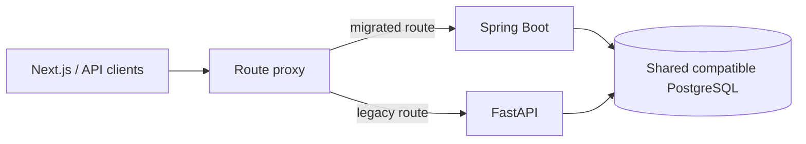

# FastAPI to Java 17 Spring Boot Migration Plan

## Strategy

Use the **strangler pattern**. Keep the Next.js frontend, Supabase Auth, PostgreSQL, Storage, and
public API contract stable. Route selected endpoints to Spring Boot only after compatibility tests
pass. FastAPI remains the rollback target until the final cutover.

Do not rewrite the frontend and backend simultaneously. Do not perform a one-shot database rewrite.

## Phase 0 — Freeze and measure the current contract

- Capture the current OpenAPI document and representative request/response fixtures.
- Add end-to-end smoke tests for login/bypass, agents, skills, schemas, secrets, runs, and publish.
- Record current schema, indexes, environment variables, and known behavior differences.
- Add correlation IDs and baseline latency/error measurements.
- Decide which current defects are compatibility requirements versus defects to fix explicitly.

**Gate:** the existing system has a repeatable smoke test and rollback baseline.

## Phase 1 — Java foundation

- Create `backend-java/` Maven multi-module project using Java 17.
- Add Spring Boot, Spring Modulith, Actuator, Security, Validation, JPA, Flyway, Testcontainers,
  Resilience4j, Micrometer, and OpenTelemetry.
- Connect read-only to the current schema first.
- Implement Supabase JWT validation and tenant context.
- Implement RFC Problem Details, request IDs, structured logging, and health endpoints.
- Add architecture tests that prevent module-boundary violations.

**Gate:** Java health/security tests pass; cross-tenant access is denied.

## Phase 2 — Read-only control plane

- Implement list/get routes for tools, skills, schemas, agents, versions, runs, and steps.
- Match existing JSON field naming and status codes.
- Run consumer-driven contract tests against both backends.
- Shadow Java reads in non-production or for sampled traffic and compare results.

**Gate:** response equivalence is accepted for every migrated read route.

## Phase 3 — Mutable control plane

- Migrate skills, schemas, agents, versions, triggers, MCP registrations, and connectors.
- Add optimistic locking and immutable snapshot rules.
- Introduce expand-only Flyway migrations compatible with both backends.
- Route one module at a time to Java with an immediate proxy rollback switch.

**Gate:** create/edit/publish flows pass contract and end-to-end tests.

## Phase 4 — Secrets and content

- Implement compatible decryption or perform an audited re-encryption migration.
- Never return or log secret values during comparison.
- Migrate signed upload, storage metadata, parsing jobs, and content lifecycle.
- Introduce stable content hashes and ingestion generations.

**Gate:** existing secrets resolve, uploads work, and failure leaves recoverable state.

## Phase 5 — Runtime parity

- Implement model ports and OpenAI/Anthropic adapters.
- Reproduce the current bounded tool loop and JSON Schema behavior.
- Implement built-in tools, MCP, connectors, traces, token usage, budgets, and redaction.
- First run deterministic fake-provider tests, then a small real-provider canary dataset.
- Shadow only safe/read-only tool runs; never duplicate side-effecting calls.

**Gate:** golden run suite and evaluation thresholds pass; cost/latency regression is understood.

## Phase 6 — Asynchronous runtime

- Add durable job/lease tables and `202` run submission.
- Add runtime worker profile, SSE replay, cancellation, retries, dead-letter handling, and
  graceful shutdown.
- Maintain a temporary synchronous compatibility endpoint if the current frontend needs it.
- Update the frontend to submit then subscribe/poll.

**Gate:** crash/recovery, duplicate request, spike, soak, and provider-failure tests pass.

## Phase 7 — RAG and evaluation platform

- Add pgvector migration, deterministic ingestion, hybrid retrieval, citations, and RAG metrics.
- Add dataset/case result persistence and experiment configuration versions.
- Gate publishing on the configured evaluation policy.

**Gate:** retrieval and answer regression suites meet declared thresholds.

## Phase 8 — Cutover and retirement

- Shift traffic gradually: internal -> canary tenants -> 10% -> 50% -> 100%.
- Observe SLOs, queue age, DB load, provider errors, and cost at each step.
- Keep FastAPI read-only/standby for an agreed rollback window.
- Stop FastAPI writes, verify no old jobs remain, archive its deployment, then remove it.
- Contract database columns only after no released component reads them.

**Gate:** full traffic remains healthy for the rollback window and recovery drill succeeds.

## Routing during migration

Only one backend owns writes for a resource module at a time. Dual writes are avoided. If data
must be copied, use an outbox/change process with reconciliation rather than application-level
best-effort dual writes.

## Suggested implementation order for learning

1. Java project skeleton, health endpoint, and tests.
2. JWT/tenant security.
3. Skills and schemas CRUD.
4. Agent drafts, snapshots, and publish rules.
5. Direct model call and token accounting.
6. Manual tool-calling loop from first principles.
7. Spring AI adapter comparison.
8. Durable runs and SSE traces.
9. Document ingestion and pgvector RAG.
10. RAG evaluation, scheduling, resilience, and load testing.

This sequence lets us learn each AI engineering mechanism before adopting a framework abstraction.
