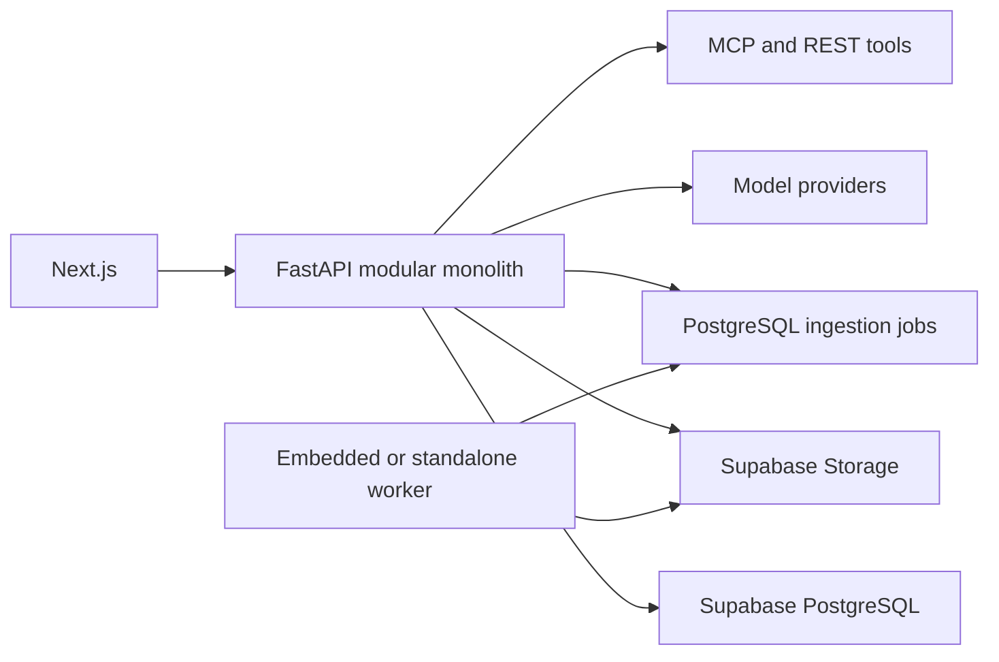

# Agent Studio Python/FastAPI — High-Level Design

Agent Studio is a Python 3.12 modular monolith. Next.js calls FastAPI directly; FastAPI owns all
authentication, authorization, transactions, AI execution and external integrations. Supabase
provides PostgreSQL, Auth and private object storage.

Modules communicate through application-owned interfaces rather than vendor objects. Provider,
storage and tool implementations are adapters. Tenant identity is required at every application
use case and repository boundary. Long-running ingestion and agent work will move to durable
PostgreSQL jobs without introducing another backend language.

Reliability policies include bounded calls, timeouts, deterministic failure classification,
idempotent writes, correlation IDs and dependency readiness. Secrets and authorization headers
are redacted from logs and traces.

## Knowledge foundation

Documents are owned by tenant-scoped knowledge bases rather than agents. A knowledge base can later
be bound immutably to multiple agent versions. During the compatibility period, legacy `agent_id`
remains nullable on content so existing document search continues to work while new content uses
`knowledge_base_id`. Archiving preserves metadata and storage objects.

## Durable document ingestion

Uploads are limited to 20 MB and accepted only as byte-detected PDF or strict UTF-8 text/Markdown.
The API stores the object, creates a `queued` content record and job, and returns immediately. A
bounded worker moves content through `queued → processing → ready|failed`. PostgreSQL row locks,
leases and idempotent completion allow safe operation across multiple replicas. `ready` means text
extraction succeeded; it does not imply chunking, embedding, indexing or RAG availability.

## Semantic index foundation

Every extraction-ready document is queued for deterministic chunking and local embedding with
`BAAI/bge-small-en-v1.5`. Embeddings remain inside Supabase PostgreSQL using pgvector and a
384-dimensional HNSW cosine index. Indexing has an independent leased-job lifecycle, so model or
chunking upgrades can reindex content without re-uploading or re-extracting it.

The retrieval-debug API embeds a query locally, applies tenant and knowledge-base filters, and
returns ranked source chunks. The Content Store still presents these as evidence candidates; agent
runtime generation and verified citations are handled by grounded RAG, while reranking remains deferred.

## Grounded hybrid RAG

Agent versions bind up to five tenant-owned knowledge bases through an immutable many-to-many
configuration. Runs combine local semantic similarity with PostgreSQL English full-text ranking,
fuse candidate ranks, enforce document diversity and fit evidence into free or standard context
budgets. Automatic retrieval supplies initial evidence and the bounded `search_documents` tool can
retrieve follow-up evidence from the same bindings.

Every run owns an evidence ledger. Models cite only ledger source IDs; the server resolves IDs to
trusted document metadata and rejects invented citations. The internal final-answer envelope is
unwrapped so existing structured `run.output` contracts remain unchanged.

## Deterministic RAG evaluation

Golden datasets belong to a tenant and agent. Cases label expected structured output and optional
document/chunk evidence. A PostgreSQL-leased worker executes real agent runs, commits each case
independently, and aggregates retrieval, citation, grounding, latency, and output metrics. Definitions
and thresholds are snapshotted for reproducibility. Publishing requires the latest result for the exact
version to pass every applicable gate and match the current dataset timestamp. No judge model is used.

## Pluggable AI runtime

Agent Studio owns a small runtime-session port. Direct provider SDK sessions and LangChain LCEL are
adapters behind that port; the application executor continues to own tenant authorization, budgets,
tool dispatch, evidence ledgers and final-answer validation. Runtime selection is stored in immutable
version configuration and snapshotted onto every run. LangChain composes prompts, messages and bound
chat models without using `create_agent`, checkpoints, memory or graph execution. Local callbacks retain
only timing and usage metadata; LangSmith tracing is disabled.
### Durable workflow runtime

Workflow agents use a LangGraph research graph while task and chat agents retain synchronous runtimes.
The API persists a tenant-owned execution and PostgreSQL job, then returns `202`. Leased workers resume
from encrypted PostgreSQL checkpoints, interrupt before MCP/connector effects, and retain terminal
checkpoints for 30 days. Public access is authorized through workflow ownership rather than checkpoint
table identifiers.

### Conversational memory

Opt-in chat conversations are tenant-owned and pinned to immutable agent versions. FastAPI assembles
bounded context from a structured older-history summary and recent turns, marks it as untrusted, and
passes it through the same Direct or LangChain runtime. PostgreSQL RLS, tenant-matched foreign keys,
explicit deletion and rolling 30-day retention protect the data. Task and workflow agents receive no
conversation history.

### Production observability

State-changing transactions append tenant-owned lifecycle events to PostgreSQL. Authenticated SSE
queries the durable sequence with replay cursors; browser disconnects never affect jobs. A built-in
Operations workspace combines events, queue ages and global worker heartbeats. Existing detailed trace
tables remain authoritative while live-event payloads contain bounded metadata only.
