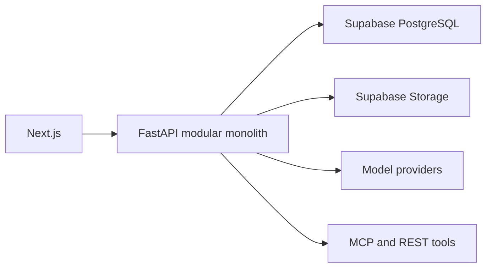

# Agent Studio Python/FastAPI — High-Level Design

Agent Studio is a Python 3.12 modular monolith. Next.js calls FastAPI directly; FastAPI owns all
authentication, authorization, transactions, AI execution and external integrations. Supabase
provides PostgreSQL, Auth and private object storage.

Modules communicate through application-owned interfaces rather than vendor objects. Provider,
storage and tool implementations are adapters. Tenant identity is required at every application
use case and repository boundary. Long-running ingestion and agent work will move to durable
PostgreSQL jobs without introducing another backend language.

Reliability policies include bounded calls, timeouts, deterministic failure classification,
idempotent writes, correlation IDs and dependency readiness. Secrets and authorization headers
are redacted from logs and traces.

## Knowledge foundation

Documents are owned by tenant-scoped knowledge bases rather than agents. A knowledge base can later
be bound immutably to multiple agent versions. During the compatibility period, legacy `agent_id`
remains nullable on content so existing document search continues to work while new content uses
`knowledge_base_id`. Archiving preserves metadata and storage objects.
